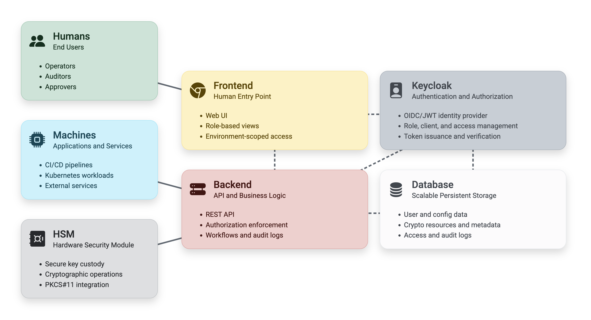

# KeyAuthority

KeyAuthority is a platform for managing private Certificate Authorities, X.509 certificates, and application secrets across Kubernetes environments. The tool simplifies certificate lifecycle management and secure secret distribution for applications and microservices.

## Architecture

KeyAuthority consists of:

- Frontend: ReactJS application
- Backend: Go application
- Keycloak: Identity provider
- PostgreSQL: Relational database

KeyAuthority flows integrate with humans, machines, and HSMs. Below is an overview of the architecture where dashed lines represent internal interactions; solid lines represent external interactions.



## Installation

Deploy KeyAuthority to Kubernetes using Helm. See the [Artifact Hub package](https://artifacthub.io/packages/helm/keyauthority/keyauthority) for installation instructions and configuration options.

## Local development

The local development setup allows you to run KeyAuthority components in Docker containers for testing and development purposes.

### Prerequisites

- Docker
- GNU Make

### Steps

#### 1. Start PostgreSQL

From `./postgres`:

```shell
make docker-run
```

#### 2. Start Keycloak

From `./keycloak`:

```shell
make docker-create-db
make docker-run
```

Wait for Keycloak to become ready. Then create `realm.json` using the KeyAuthority Helm chart and configure it as follows:

- Set `sslRequired` to `none` in the realm settings.
- Set the client secret to the value in `.config/shared.env` for the `keyauthority-exchange` client settings.
- Set the `rootUrl`, `adminUrl`, `redirectUris`, and `webOrigins` to `http://localhost:3000` in the `keyauthority-frontend` client settings.

Then run:

```shell
make docker-remove-ssl-requirement
make docker-stop
make docker-run
```

Wait for Keycloak to become ready, then run the provisioner:

```shell
make docker-run-provisioner
```

#### 3. Start the backend

From `./backend`:

```shell
make docker-create-db
make docker-run
```

#### 4. Start the frontend

From `./frontend`:

```shell
make docker-run
```

The frontend will be available at [http://localhost:3000](http://localhost:3000).

## Administration

For access-control configuration and other administrative tasks, see the [KeyAuthority Administration documentation](https://staging.keyauthority.net/docs/admin).

The documentation is part of our live demo, so registration is required to access it.

## Security and vulnerability scanning

KeyAuthority images are hosted on [Docker Hub](https://hub.docker.com/u/keyauthoritydh) and regularly scanned with [`trivy`](https://github.com/aquasecurity/trivy). The latest results are available in the [Artifact Hub security report](https://artifacthub.io/packages/helm/keyauthority/keyauthority?modal=security-report).

PostgreSQL and Keycloak are repackaged with Red Hat Universal Base Image (UBI) minimal images to reduce their attack surface. You can use the official images instead by overriding the image repository and tag in `values.yaml`.

See the vendor documentation for details:

- [PostgreSQL Docker Hub image](https://hub.docker.com/_/postgres)
- [Keycloak Quay image](https://quay.io/repository/keycloak/keycloak)

## HSM support

To use HSM keys, repackage the backend image with the required PKCS#11 libraries. Configuration files and credentials can be mounted as volumes or provided through environment variables.

Example:

```dockerfile
FROM keyauthoritydh/backend:1.4.8

COPY ./pkcs11.so /usr/lib/pkcs11/pkcs11.so

ENV LD_LIBRARY_PATH="/usr/lib/pkcs11:${LD_LIBRARY_PATH}"
```

After deploying and configuring the backend, HSM keys can be referenced with a PKCS#11 URI such as:

```text
pkcs11:module-path=/usr/lib/pkcs11.so;token=MyToken;object=MyKey;
```